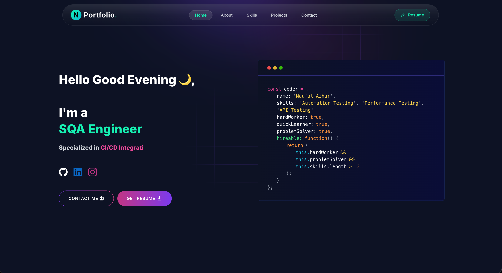

# 🚀 Naufal Azhar — Developer Portfolio

A modern and interactive portfolio website built with **Next.js**, showcasing my experience as a **Software Quality Assurance Engineer**. This portfolio highlights automation testing projects, mobile testing, API testing, performance testing, QA documentation, technical skills, and professional experience.

## 🌐 Live Demo

👉 https://naufalv3.netlify.app/

---

# ✨ Features

- 🎨 Modern UI with glassmorphism
- ⚡ Built with Next.js App Router
- 🎥 Smooth animations using Framer Motion
- 🌙 Dark theme
- 📱 Fully responsive
- 📂 Dynamic Project Case Study pages
- 🧩 Interactive Tech Stack
- 📈 Professional QA Portfolio
- 📬 Contact form with EmailJS
- 📰 Blog integration
- 🚀 Optimized performance

---

# 📸 Preview



---

# 🛠 Tech Stack

## Frontend

- Next.js
- React
- Tailwind CSS
- Sass

## Animation

- Framer Motion
- Lottie React

## Icons

- React Icons

## Services

- EmailJS

## Deployment

- Netlify

---

# 📂 Project Structure

```text
app
├── about
├── contact
├── projects
│   └── [slug]
├── skills
├── components
├── css
└── layout.js

public
├── image
├── svg
└── lottie

utils
├── data
├── helper
└── skill-image.js
```

---

# 🚀 Getting Started

## Clone Repository

```bash
git clone https://github.com/naufalazhar65/NAUFAL-PORTFOLIO-V3.git
```

```bash
cd NAUFAL-PORTFOLIO-V3
```

---

## Install Dependencies

```bash
npm install
```

or

```bash
yarn
```

---

## Run Development Server

```bash
npm run dev
```

Open

```
http://localhost:3000
```

---

# ⚙ Environment Variables

Create a `.env.local`

```env
NEXT_PUBLIC_EMAILJS_SERVICE_ID=
NEXT_PUBLIC_EMAILJS_TEMPLATE_ID=
NEXT_PUBLIC_EMAILJS_PUBLIC_KEY=
```

---

# 🧩 Customization

Most portfolio content can be customized inside:

```text
utils/data/
```

Including:

- Personal Information
- Experience
- Skills
- Education
- Projects
- Blog
- Contact

---

# 📦 Dependencies

| Package |
|---------|
| Next.js |
| React |
| Tailwind CSS |
| Sass |
| Framer Motion |
| React Icons |
| Lottie React |
| React Toastify |
| EmailJS |

---

# 📈 Lighthouse

- ✅ Performance
- ✅ Accessibility
- ✅ Best Practices
- ✅ SEO

*(Latest score available in production build.)*

---

# 👨‍💻 Author

**Naufal Azhar**

Software Quality Assurance Engineer

- GitHub: https://github.com/naufalazhar65
- LinkedIn: https://www.linkedin.com/in/naufal-azhar-0b2070240/
- Portfolio: https://naufalv3.netlify.app/

---

# 📄 License

This project is licensed under the MIT License.